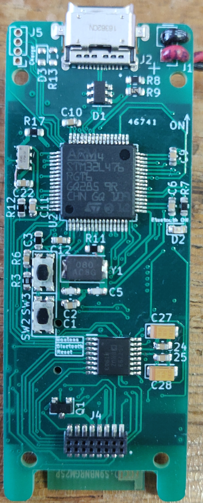
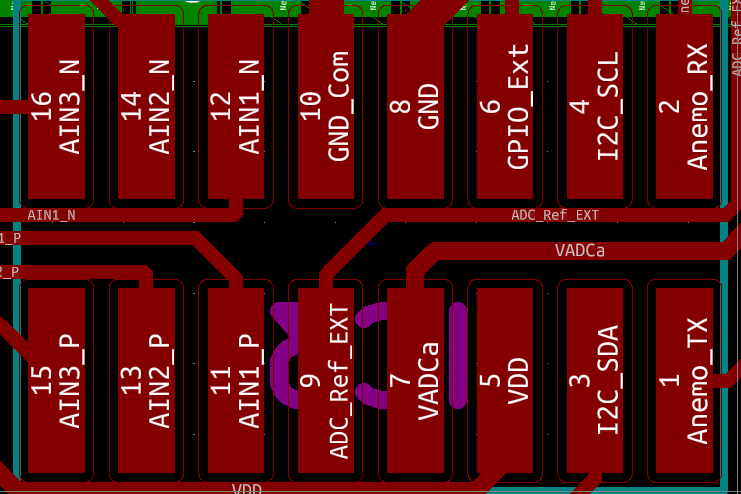
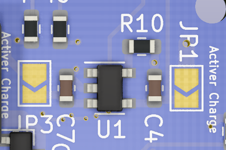
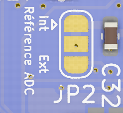

# Présentation matérielle

## Quelques chiffres
| Tension d'alimentation | Consommation en fonctionnement | Consommation en extinction |
|:----------------------:|:------------------------------:|:--------------------------:|
|       3.2V - 5.5V      |              15mA              |            2.6uA           |

La carte est assez simple d'utilisations. Il y a tout de même quelques points à prendre en considérations :

- Le switch principal permet d'allumer ou d'éteindre le microcontrôleur, il faut toujours le laisser en position OFF lors de la charge de batterie.
- Le connecteur USB permet de transférer les données ainsi que de charger la batterie (si la fonction est activée). Il ne peut alimenter le système complet.
- Lors de la soudure de l'alimentation veillez à vérifier deux fois les polarités même si une protection est mise en place.
- Le chargeur permet de charger un élément Li-ion ou Li-Po peu importe la capacité, mais la charge sera limitée à 500mA donc la charge peut durer un long moment.

## Entrées - Sorties

Il y a sur cette carte de nombreuses entrées et sorties afin que l'utilisateur puisse facilement adapter son application avec ce système.*

Tout d'abord, afin de programmer la carte, il y a le connecteur J3 fonctionne avec un connecteur à contact que l'utilisateur doit tenir lors de la programmation.

Il y a aussi le connecteur principal de carte fille qui peut être facilement utilisé avec celles-ci et notamment la carte "libre" qui permet de faire sois-même le conditionnement et le câblage avec le convertisseur, l'UART, l'I2C mais aussi la masse commutée afin de gérer l'alimentation d'un périphérique externe.

## Fonctions activables

Certaines fonctions sont activables ou non en réalisant un pont de soudure à l'endroit voulu.

JP1 et JP3 permettent une fois soudés, d'activer la charge de la batterie. Le fait de le garder activé ne fait absolument pas varier la consommation de la carte.

JP2 permet de choisir la référence de tension du convertisseur AD7799. Par défault, il est relié électriquement à la référence interne qui est un composants dédié (ADR381) qui permet d'avoir une tension de 2.5V ultra précise. Si vous voulez mettre le jumper sur la position externe, il faudra soit coupé la piste en cuivre entre le point milieu et interne du jumper ou enlever la soudure et la refaire la position externe.

